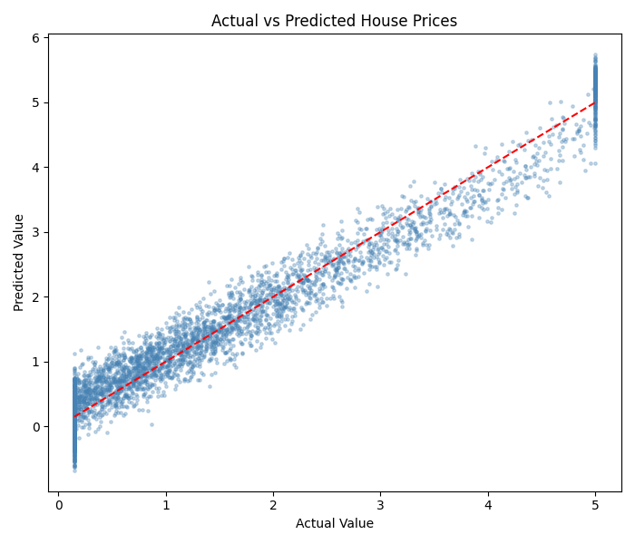

# Maincrafts AI & ML Internship

A hands-on **Artificial Intelligence & Machine Learning internship project** covering regression, model evaluation, feature scaling, and prediction visualization with Python and scikit-learn.

## 📌 Internship Tasks

### Task 1 — Basic Machine Learning Model

Implemented a **Linear Regression** model for house-price prediction using a California-style housing dataset generated from the task requirements.

**Workflow:**
- Created and prepared the dataset with NumPy and Pandas
- Split data into training and test sets
- Trained a Linear Regression model
- Evaluated the model using **MAE, RMSE, and R²**
- Saved the trained model with Joblib
- Generated an actual-vs-predicted visualization

### Task 2 — House Price Prediction

Built and compared multiple regression models using the **California Housing dataset** from scikit-learn.

**Models evaluated:**
- Linear Regression
- Ridge Regression
- Decision Tree Regressor

**Workflow:**
1. Loaded the California Housing dataset
2. Standardized the input features
3. Split the data into training and test sets
4. Trained three regression models
5. Compared performance using RMSE and R²
6. Visualized actual vs. predicted house prices

## 📊 Model Comparison

| Model | RMSE | R² Score |
|---|---:|---:|
| Linear Regression | 0.745581 | 0.575788 |
| Ridge Regression | 0.745554 | 0.575819 |
| Decision Tree | **0.724234** | **0.599732** |

**Best-performing model:** Decision Tree Regressor, based on the highest R² score and lowest RMSE among the reported results.

## 📈 Prediction Visualization

The repository includes an actual-vs-predicted house-price visualization generated during the internship work.



## 🛠️ Tech Stack

- **Language:** Python
- **Data Analysis:** Pandas, NumPy
- **Machine Learning:** scikit-learn
- **Visualization:** Matplotlib, Seaborn
- **Model Persistence:** Joblib

## 📂 Project Structure

```text
maincrafts-ai-ml-internship/
├── README.md
├── .gitignore
├── m.py
├── task1.py
├── task2.py
├── actual_vs_predicted.png
├── linear_regression_model.pkl
└── requirements.txt
```

> `*.pkl` files are ignored for newly generated local model artifacts. The existing tracked model file is retained as part of the original internship work.

## ▶️ How to Run

### 1. Clone the repository

```bash
git clone https://github.com/tcnomithareddy28-cloud/maincrafts-ai-ml-internship.git
cd maincrafts-ai-ml-internship
```

### 2. Create and activate a virtual environment

```bash
python -m venv venv
```

**Windows:**
```bash
venv\Scripts\activate
```

**macOS/Linux:**
```bash
source venv/bin/activate
```

### 3. Install dependencies

```bash
pip install pandas numpy scikit-learn matplotlib seaborn joblib
```

### 4. Run the tasks

```bash
python task1.py
python task2.py
```

## 🎯 Skills Demonstrated

- Regression model development
- Train/test data splitting
- Feature scaling with StandardScaler
- Model comparison and evaluation
- MAE, RMSE, and R² interpretation
- Data visualization
- Model serialization with Joblib
- Python-based machine learning workflow

## 👩‍💻 Author

**Nomitha Reddy**

AI & ML | Python | Machine Learning
